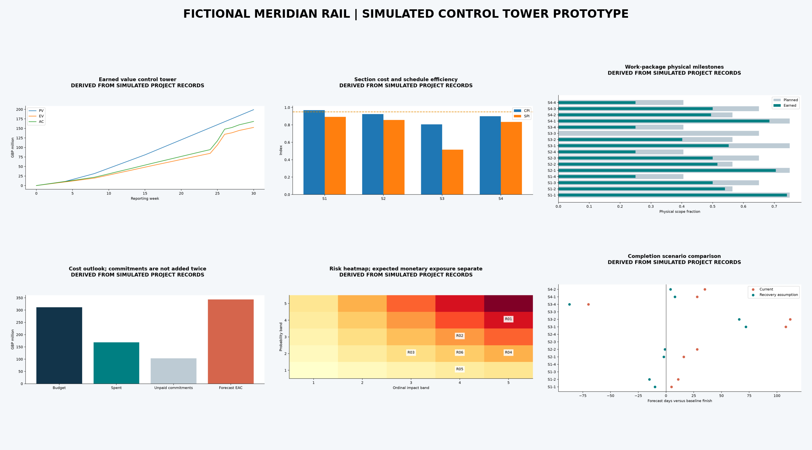

# Rail Infrastructure Project Control Tower

**Schedule, Cost, Risk & Performance Analytics** · Python / pandas / NumPy / Matplotlib / earned value / scenario forecasting / Power BI specification

This reproducible project answers a controls manager's question: where should intervention focus on a 68-mile expansion, what is the cost outlook, and which completion claims can the data support? The Meridian expansion is entirely **FICTIONAL / SIMULATED**, inspired by a project-management job simulation. It is not a Siemens or Network Rail engagement. Two official ORR snapshots supply separate **OBSERVED operational context**, never fabricated construction records.



## Decision and measured demonstration outputs

At simulated status date **3 August 2026**, 16 work packages across four sections earn **48.97% of GBP311.60m approved scope**. The seeded ledger contains **496 cumulative weekly records**. CPI is **0.906**, SPI **0.766**, earned-value cost variance **-GBP15.75m**, and schedule variance **-GBP46.58m** (a monetary variance, not days). CPI-persistence EAC is **GBP343.77m**, **GBP32.17m above budget**. These numbers are calculated scenario outputs, not claimed real-world project outcomes or savings.

The designed S3 productivity and cost shortfall justifies a possession-access and electrification-supply review. Seven incomplete packages have no completed units in the last four reporting intervals; consequently a defensible overall completion date is **unavailable**. The latest forecastable package is **22 March 2027**, not an overall project commitment. A recovery assumption of 25% greater recent production and 8% premium on remaining costs raises EAC to **GBP357.81m**; it does not resolve packages with zero production. Six simulated risks total **GBP14.30m expected monetary exposure**, reported separately from contingency/EAC because risks can overlap.

Inspect [machine-readable results](reports/results.json), [executive report](reports/executive_summary.pdf), [technical controls report](reports/project_controls_report.pdf), [risk report](reports/risk_report.pdf), and the [interactive local dashboard](dashboard/index.html). The PNG is a programmatically rendered prototype overview; there is no native PBIX/TWB file.

## Reproduce independently

Tested with Python 3.14 and exact library versions in requirements.txt. From this repository root:

```bash
python -m venv .venv
# Activate .venv using your operating system's normal command.
python -m pip install -r requirements.txt
python -m src.pipeline
python -m pytest -q
python scripts/execute_notebooks.py
```

Raw licensed snapshots are included (about 101 KB total), so analyses do not require network access. Pipeline regenerates processed tables, figures, reports and dashboard assets. The notebook runner executes all seven notebooks; each imports calculation modules and performs a substantive analysis. CI repeats these commands on Python 3.14. PDF metadata may vary between runs; quantitative results and seeded data are deterministic. See [data contract and download instructions](data/README.md) and [source hashes](data/manifest.json).

## Method and architecture

`src/data_sources.py` parses actual HTML/ODS schemas; `src/pipeline.py` generates the seeded physical ledger, calls analysis modules and renders deliverables. `schedule.py` computes status and milestones, `kpi_engine.py` aggregates budget-weighted EV, `cost.py` forecasts costs without counting commitments twice, `risk.py` separates expected money from ordinal score, and `forecast.py` extrapolates recent production with explicit missing forecasts. Seven notebooks cover source validation, quality, ORR context, EVM, cost sensitivity, risk and forecasting. Tests cover reconciliation, zero denominators, RAG boundaries, invalid inputs, monotonic quantities and forecast edge cases.

PV=sum(BAC×planned fraction), EV=sum(BAC×earned physical fraction), AC=sum(actual cost), CPI=EV/AC and SPI=EV/PV. EAC=AC+(BAC−EV)/CPI, floored at AC+outstanding unpaid commitments. Outstanding commitments exclude spend and are not added again to EAC. Scope uses native route-miles/stations/signaling installations; unlike units are never summed. Budget-weighted progress and physical completed units are clearly distinct.

The [six-page dashboard specification](dashboard/dashboard_specification.md) defines every KPI's formula, source, owner, refresh and thresholds, with relational grain and acceptance rules. [Assumptions](ASSUMPTIONS.md) document simulated budgets, production, risk and recovery. [Traceability](TRACEABILITY.md) connects each finding to source, calculation, figure and action. The project-code licence is [MIT](LICENSE); ORR source data retains OGL v3.0 attribution.

## Source and validity boundaries

[ORR Table 3181a](https://dataportal.orr.gov.uk/statistics/performance/passenger-rail-performance/table-3181a-delay-minutes-per-1-000-train-miles-total-by-network-rail-region-periodic-1/) contains 96 railway periods × 11 fields of regional delay rates. [Table 6320](https://dataportal.orr.gov.uk/statistics/infrastructure-and-environment/rail-infrastructure-and-assets/table-6320-infrastructure-on-the-mainline/) contains 79 annual nation records × seven substantive fields. Source Network Rail, with infrastructure also TfL and Amey Infrastructure Wales; accessed 28 September 2026. Contains Office of Rail and Road data licensed under OGL v3.0. These rates are contextual, not project-delay causes, and no national rate is inferred without denominators.

Forecasts are independent package extrapolations, not a resource-leveled critical-path schedule or probabilistic confidence interval. Completed discrete units create volatile short-window rates. There is no operationally proven recovery effect, real expenditure, approved change history, reserve analysis or causal inference. A real rollout would require accepted field measurements, contract commitments, dated baseline versions, constraints/dependencies and stakeholder approval.

## Resume-ready project description

**Rail Infrastructure Project Control Tower** — Python, pandas, NumPy, Matplotlib, pytest, earned value, Power BI/Tableau specification

- Built a reproducible controls pipeline for a fictional 68-mile rail expansion spanning 16 work packages and 496 weekly records, calculating CPI 0.906, SPI 0.766 and GBP343.77m scenario EAC with explicit simulation provenance.
- Integrated two official ORR snapshots and developed a six-page dashboard specification, risk register and three PDF reports while preserving operational-versus-project evidence boundaries.
- Implemented zero-rate forecast safeguards that withheld an unsupported overall finish when seven incomplete packages lacked recent completed units, linking mitigation decisions to package-level evidence.
